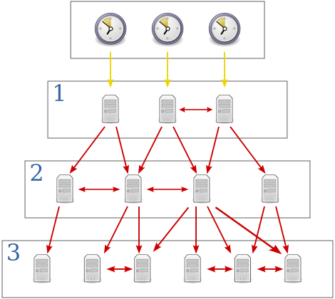
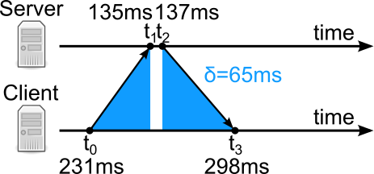

## Clock Synchronization in Distributed Systems

In a distributed system, multiple processes running on different computers need to coordinate their actions. This often requires a common understanding of time. However, each computer has its own physical clock, which is a hardware device that counts oscillations of a crystal. These clocks are not perfectly accurate and tend to drift over time, leading to discrepancies between the clocks of different computers. This is known as **clock skew**.

### Cristian's Algorithm

Cristian's algorithm is a simple method for synchronizing the clock of a client machine with a time server. The client sends a request to the server, which responds with its current time. The client then sets its clock to the server's time, but it must also account for the round-trip time of the request.

The client measures the time it takes for the request to travel to the server and back (T_round). It assumes the one-way delay is approximately T_round / 2. So, when the client receives the server's time (T_server), it sets its own clock to T_server + T_round / 2.

### Network Time Protocol (NTP)

NTP is a more sophisticated protocol for clock synchronization. It uses a hierarchical system of time servers, with the most accurate clocks at the top (stratum 1). These servers are typically synchronized with atomic clocks or GPS. Lower-level servers (stratum 2, 3, etc.) synchronize with higher-level servers.

NTP uses a more complex algorithm than Cristian's to estimate the clock offset and round-trip delay. It also uses statistical methods to filter out noisy measurements and select the most reliable time sources. This allows NTP to achieve high accuracy, often within a few milliseconds.

### Key Components and Mechanisms

A physical clock is any device that indicates time, such as a wall clock, watch, computer time-of-day clock, or processor cycle counter. In distributed systems, multiple physical clocks are involved, and they generally do not agree perfectly due to factors like network delays and clock drift.

1. **Reference clocks**:
   - NTP operates on the principle of synchronizing time with a reference clock. These reference clocks can be highly accurate sources like atomic clocks or GPS clocks. NTP servers receive time signals from these reference clocks and distribute the synchronized time to client systems. NTP typically uses UDP port 123.
     - **Atomic Clocks**: These clocks use the resonant frequency of atoms to keep time. For example, cesium atomic clocks count 9,192,631,770 cycles per second, which is defined as one second. These clocks are extremely accurate and are often used as primary time standards.
     - **GPS Clocks**: GPS satellites carry atomic clocks and provide highly accurate time signals accessible globally. NTP servers often use GPS clocks as stratum 1 sources.
     - **Radio Clocks**: These receive time signals from dedicated radio time stations and can serve as reliable time sources.

2. **NTP Hierarchical Structure**:
   - NTP operates in a hierarchical manner with different levels known as strata. Stratum levels denote the distance from the reference clock. Stratum 0 refers to the reference clocks themselves (e.g., atomic clocks), stratum 1 to servers directly connected to stratum 0 devices, and so on. Each level represents an additional hop away from the reference clock, with increasing potential for slight inaccuracies.
     - **Stratum 0**: High-precision timekeeping devices like atomic clocks or GPS receivers.
     - **Stratum 1**: Directly connected to Stratum 0 devices, these are primary time servers.
     - **Stratum 2** and lower: These are secondary servers that synchronize with Stratum 1 servers, and so on.

   Each stratum level introduces a small amount of additional delay and potential inaccuracy. The goal is to minimize these inaccuracies by selecting the most accurate time sources available. The stratum levels help in identifying the reliability of time sources and prevent time loops in the network. The diagram below illustrates the hierarchical structure of NTP.

 

### Theoretical Foundations of NTP

With NTP, the client requests time from a server and adjusts its clock based on the received response.

1. **Timestamps**:
   - NTP uses four timestamps in each exchange between a client and a server:
     - $t_0$: The time at which the request is sent by the client.
     - $t_1$: The time at which the request is received by the server.
     - $t_2$: The time at which the server sends the response.
     - $t_3$: The time at which the response is received by the client.

   Using these timestamps, the client calculates the *clock offset* (`θ`) and *round-trip delay* (`δ`).

   - **Clock Offset (θ)**: The difference in time between a client’s clock and a server’s clock.
   - **Round-Trip Delay (δ)**: The time taken for a request to travel from the client to the server and back.

   The *clock offset* (`θ`) and *round-trip delay* (`δ`) are calculated as follows:

$$
θ = ((t_1 - t_0) + (t_2 - t_3)) / 2
$$

$$
δ =  (t_3 - t_0) - (t_2 - t_1)
$$

 

1. **Clock Selection and Intersection Algorithm**: NTP uses a sophisticated algorithm called the "intersection algorithm" to select the best time source. This algorithm discards outliers by identifying the largest subset of servers with the most consistent time readings. NTP also does not rely on a single time measurement but uses multiple measurements over time to improve accuracy.

2. **Synchronization Intervals**: NTP dynamically adjusts the frequency of synchronization. In stable networks, synchronization might occur less frequently, whereas in less stable environments, NTP increases the frequency to maintain accuracy.

### Applications of NTP

NTP is critical across several domains:
- **Distributed Systems**: In distributed computing, synchronized clocks are essential for coordinating actions, ensuring data consistency, and avoiding conflicts.
- **Logging and Monitoring**: Accurate timestamps are crucial for logs and monitoring systems to correctly sequence events and identify issues.
- **Financial Transactions**: In financial systems, precise time synchronization ensures the correct ordering of transactions and compliance with regulatory requirements.
- **Telecommunications**: Network protocols and communications rely heavily on synchronized time to manage data flow and avoid collisions.
- **Scientific Research**: Precise timekeeping is vital in experiments and data collection, where measurements are time-sensitive.

### Practical Implementation Challenges

1. **Asymmetric Paths**:
   - If the path from the client to the server is different from the path from the server to the client, the round-trip delay calculation can be inaccurate.

2. **Security Concerns**:
   - NTP traffic can be susceptible to attacks such as spoofing and man-in-the-middle attacks. Secure implementations like NTPsec mitigate these risks through encryption and authentication.

### Other methods for Synchronizing clocks

- **Radio Clocks**: Radio clocks use radio signals from a radio station to synchronize distributed clocks.
- **Global Positioning System (GPS)**: This method uses the GPS satellite system to accurately synchronize clocks in distributed real-time systems.
- **Precision Time Protocol (PTP)**: This protocol is designed to achieve much higher accuracy than NTP and is used in applications where extremely precise synchronization is required.

<!-- [(REF)](https://qr.ae/pKjF6L) -->
